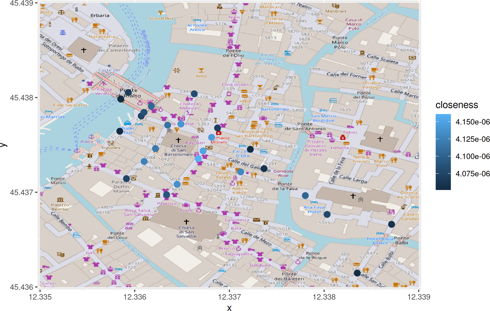

# The complex networks of Venice

Working on the Venetian city networks and modelling its state

Contains scripts to download the city network from OpenStreetMap and analyze it,
using Python and R, and data generated by it.

It's intended as support to the paper "What news close to the Rialto? The
complex nature of the urban fabric in Venice", by JJ Merelo and Uri
Hershberg, accepted at the
[CCS'25](https://drive.google.com/file/d/1UZIGmly5LwZ4NkMNXorQzxgfwiGR4ATh/view)
conference. We kindly ask you to quote it if you use the code or data in this
repository. You can download [the illustrated
abstract](https://github.com/JJ/venice-city-networks/releases/download/v0.99/node-ccs-2025.pdf).

## Results

We analyze the nodes with the highest betweenness and closeness in the Venice
city graph. Nodes have been generated from
[OpenStreetMap](https://openstreetmap.com) data; you can check the code in the
[`code`](code/) directory.

These red dots represent the points with the highest betweenness

And, in this case, highes closeness

Please check the ['node-ccs-2025.R'](papers/node-ccs-2025.R) file for how these
have been generated.

In this case, we represent a MDS projection of the graph with the nodes above
represented on the chart, so that we can have an idea of the role they play in
the city graph.

## LICENSE

(c) 2024-2025 by JJ Merelo and Uri Hershberg. Released under the [Affero GPL
license](LICENSE).
